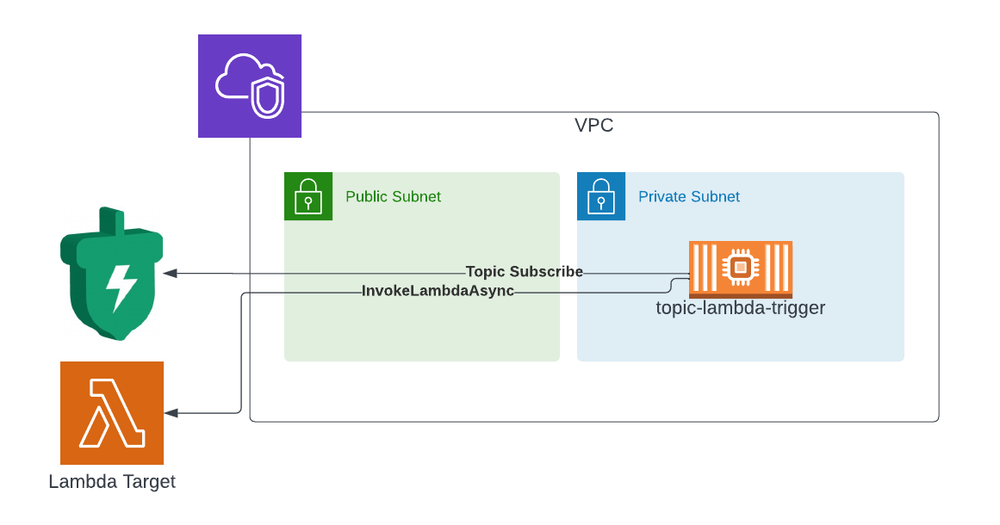

[](https://github.com/momentohq/standards-and-practices/blob/main/docs/momento-on-github.md)
[](https://github.com/momentohq/standards-and-practices/blob/main/docs/momento-on-github.md)


# topic-lambda-invoker

A container appliance that can be deployed as a standalone fargate ecs service in your AWS account to subscribe 
to a momento topic and trigger lambda functions asynchronously in your account.

For instructions on how to deploy this application please see [README](./infra/README.md) in infra folder

When deployed you will end up with an architecture like this.




## Testing

Once you have deployed the simplest way to test is by sending topics with the [Momento CLI](https://docs.momentohq.com/getting-started#install-the-momento-command-line-interface-cli). 
It's important to note that AWS lambda requires you to send invoke payloads as JSON, so you need to send messages 
through as JSON strings.

Ex:
```console
momento topic publish test-topic '{"foo": "bar24"}'
```

